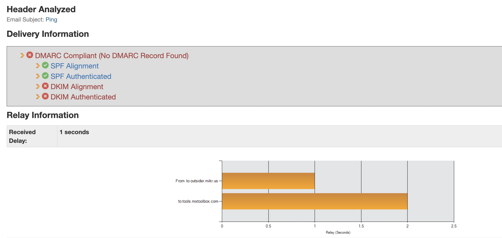
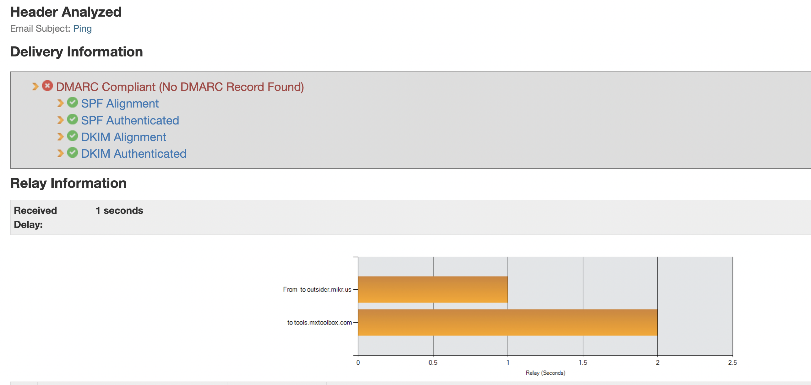
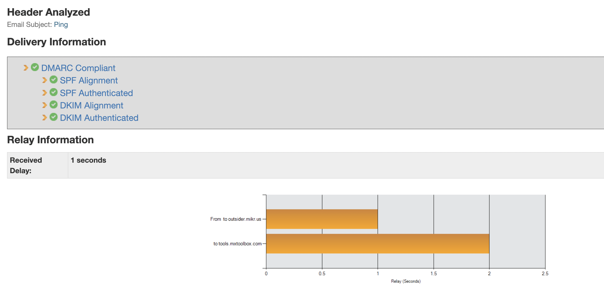

# Jak hostować pocztę na Outsiderze - cd.

Aby poczta dochodziła do odbiorców bez problemu, musimy skonfigurować parę wpisów w DNS oraz w outsiderze.

## Sprawdzenie obecnej konfiguracji

Do tego celu posłuży nam strona analizująca nagłówki maili oraz serwer mailowy (jego domenę): [mxtoolbox.com](https://mxtoolbox.com/deliverability/EmailHeaders.aspx)

Zacznijmy od sprawdzenia obecnej konfiguracji (zakładamy, że masz skonfigurowany **spf** zgodnie z instrukcją na stronie głównej outsidera)
Wyślij wiadomośc na adres [ping@tools.mxtoolbox.com](mailto:ping@tools.mxtoolbox.com) ze skrzynki, którą chcesz skonfigurować

W odpowiedzi na Twoją wiadomość system zwróci Ci link do raportu, który opisze braki w konfiguracji.

## Konfiguracja DKIM

Co to jest DKIM? Odsyłam do artykułu Google'a [artykuł](https://support.google.com/a/answer/174124?hl=pl)

Aby skonfigurować DKIM musimy wykonać 2 czynności:

1. Przechodzimy do outsidera, w zakładce z kontami email (w górnym drop-down'ie musimy mieć wybraną naszą domenę), klikamy przycisk `WŁĄCZ DKIM`
2. Następnie przechodzimy do outsider'owego panelu `Zarządzanie DNS` i dodajemy rekord TXT `x._domainkey` z wartością z outsiera w naszym DNS (np. CloudFlare)

**Uwaga** na cudzysłów - lubi się kopiować, a nie powinno go być przed i po wartości rekordu

Teraz możemy sprawdzić czy nasza konfiguracja zadziałała (wysyłamy kolejnego maila do serwisu testującego):

## Konfiguracja DMARC

Google pomoże nam w wyjaśnieniu czym jest DMARC [artykuł](https://support.google.com/a/answer/10032473?hl=pl)

Aby skonfigurować DMARC w najmniej restrykcyjnej wersji, dodajemy rekord TXT o nazwie `_dmarc` oraz wartością `v=DMARC1; p=none; fo=1; rua=mailto:{{TWÓJ_EMAIL}}`

Teraz możemy sprawdzić konfigurację, która powinna świecić się na zielono jak testy w naszych aplikacjach:

Po tygodniu testów możemy zmienić wartość `p` zgodnie z zaleceniami w artykule Google'a.

**Gratulacje!**

[Powrót do strony głównej](/)